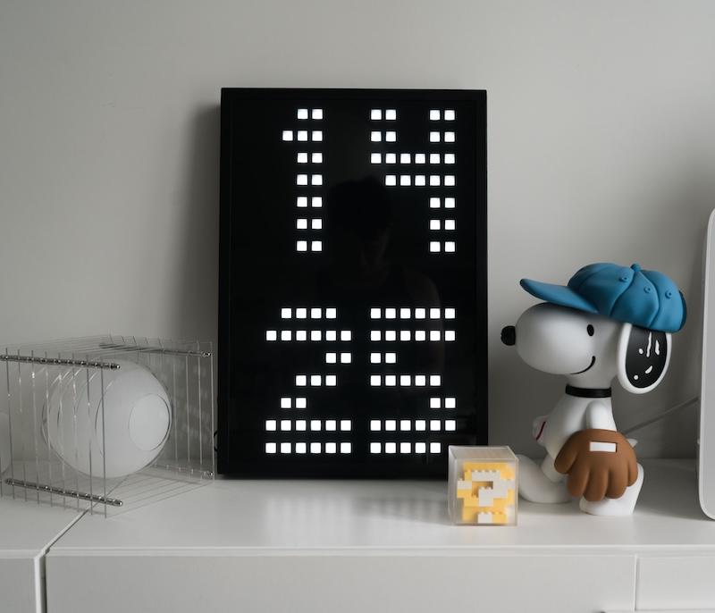
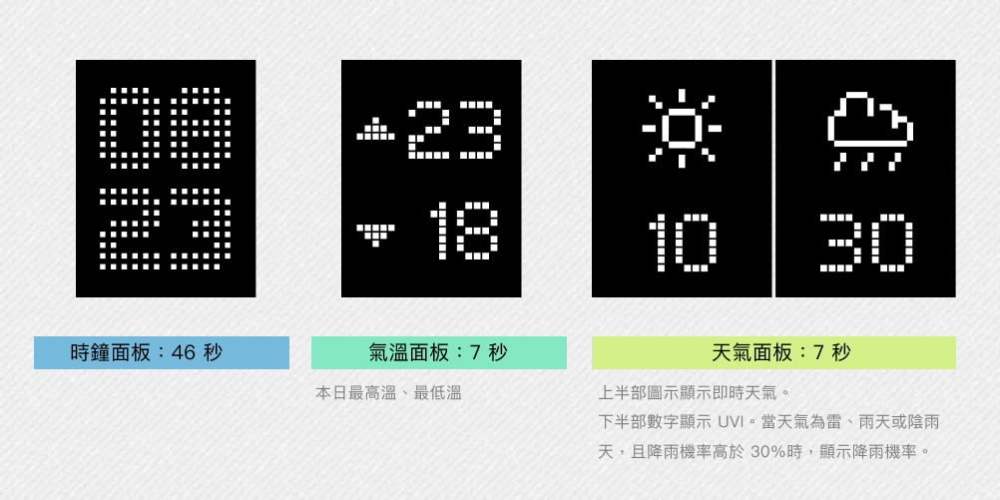
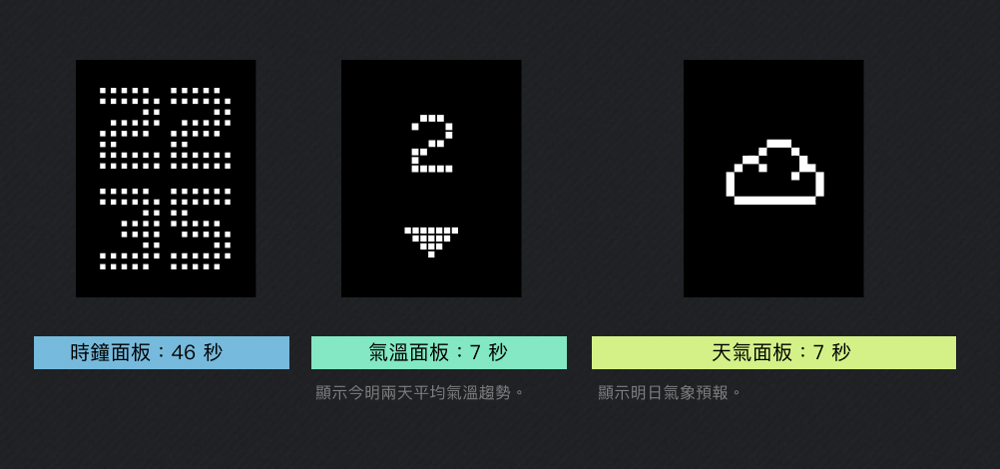

# IKEA OBEGRÄNSAD - Home Assistant 氣象監測時鐘版



這是基於 [IKEA OBEGRÄNSAD LED 燈板](https://www.ikea.com.hk/zh/products/luminaires/wall-lamps-and-wall-spotlights/obegransad-art-80526254) 進行改裝的 ESP32 專案。本專案針對個人使用環境進行深度在地化優化，利用 Home Assistant 整合各種感測器、OpenUV 與中央氣象署 (CWA) 等整合數據進行資訊顯示。

## 🖼 畫面顯示範例

本面板除了時鐘面板以外，另外設計了氣溫與天氣面板，使三種面板自動輪撥切換。並且設計了日間模式與夜間模式，以符合日常生活的資訊需求：

### ☀ 日間模式 (Day Mode)



日間模式會顯示當天的最高溫與最低溫預報，並且在即時天氣圖示中，根據當時的天氣預報改變顯示數值，當為晴天、晴時多雨時，數字顯示紫外線指數。而當天氣為雷、雨天或陰雨天，且降雨機率高於 30％ 時，顯示降雨機率。

### 🌙 夜間模式 (Night Mode)



夜間模式僅顯示今明兩天氣溫平均值的差異以及明日天氣預報圖示。


## 🌟 核心功能
* **在地化氣象顯示**：
    * 整合 `OpenCWA` (中央氣象署)，即時顯示新莊區天氣圖示。
    * 整合 `OpenUV` 並且設定抓取頻率，提供即時顯示紫外線指數。
    * 顯示今日最高溫與最低溫預報，並使用自定義**向上/向下三角形**增強視覺辨識。
    * 顯示今日即時天氣圖示，並且依據天氣類型顯示 UV 或是降雨機率。
    * 夜間時顯示明日預報，使用「明日平均氣溫趨勢」面板，顯示升溫/降溫/持平預報。
* **輪播節奏**：
    * **時鐘**顯示 46 秒 (0-45秒)。
    * **溫度面板**顯示 7 秒 (46-52秒)：
        * 白天顯示今日高/低溫。
        * 夜間顯示明日氣溫趨勢（夜間時段可在 Web 介面調整，支援跨日例如 19~6）。
    * **天氣圖示面板**顯示 7 秒 (53-59秒)：
        * 白天顯示當前天氣圖示與 UV 指數（或降雨機率）。
        * 夜間顯示明日天氣預報圖示。
        * （測試中）即時降雨機率透過 `OpenCWA` 雲端資訊資訊與本地濕度感應器進行比對計算修正預測值。        

## 🛠 硬體需求
* **IKEA OBEGRÄNSAD** LED 點陣燈板 (16x16)。
* **ESP32** 開發板 (取代 IKEA 原廠控制器)。
* 硬體改裝與接線配置請參考[原專案](https://github.com/PiotrMachowski/ikea-led-obegraensad)
* 接入後的硬體控制由 [IKEA OBEGRÄNSAD LED 整合](https://github.com/lucaam/ikea-obegransad-led)進行控制
* **⚠️ 供電重要提醒**：
    * 請務必使用 **12W (5V/2.4A)** 以上的優質供電器（推薦使用 iPad 充電頭）。
    * **原因**：ESP32 在啟動 WiFi 抓取資料時瞬時電流較大，若使用一般 5W (5V/1A) 供電器會導致電壓掉落，造成系統反覆重啟。

## 🏠 Home Assistant 設定 (YAML)

由於 Home Assistant 的氣象實體不直接開放預報屬性，需在 `configuration.yaml` 中加入「觸發型樣板感測器」來提取最高/最低溫：

```yaml
template:
  - trigger:
      - platform: time_pattern
        minutes: "/15"
      - platform: time
        at: "20:00:00"
      - platform: homeassistant
        event: start
      - platform: event
        event_type: "force_update_weather"
    action:
      - service: weather.get_forecasts
        data:
          type: daily
        target:
          entity_id: weather.opencwa_xin_zhuang_qu
        response_variable: daily_data
  # 取得當天最高溫預報 
    sensor:
      - name: "CWA Max Temp"
        unique_id: cwa_max_temp
        unit_of_measurement: "°C"
        state: >
          
          
            
            {{ fc[0].temperature if fc else 0 }}
           0 
  # 取得當天最低溫預報 
      - name: "CWA Min Temp"
        unique_id: cwa_min_temp
        unit_of_measurement: "°C"
        state: >
          
          
            
            {{ fc[0].templow if fc else 0 }}
           0 
  # 取得新莊即時降雨機率
      - name: "新莊即時降雨機率"
        unique_id: xinzhuang_current_pop
        unit_of_measurement: "%"
        icon: mdi:weather-rainy
        state: >
          
          
            
            {{ fc[0].precipitation_probability if fc and fc[0].precipitation_probability is defined else 0 }}
           0 
  # 取得新莊未來三小時降雨機率
      - name: "新莊未來三小時降雨機率"
        unique_id: xinzhuang_pop_next_3h
        unit_of_measurement: "%"
        icon: mdi:water-percent
        state: >
          
          
            
            {# 直接抓取當下的降雨機率 #}
            {{ fc[0].precipitation_probability if fc and fc[0].precipitation_probability is defined else 0 }}
           0 
 # 取得明日氣溫趨勢
      - name: "明日氣溫趨勢"
        unique_id: tomorrow_avg_temp_trend
        unit_of_measurement: "°C"
        state: >
          
          
            
            
              {{ (fc[1].temperature - fc[0].temperature) | round(1) }}
             0 
           0 
        attributes:
          advice: >
            
             "明天明顯變熱，建議穿輕薄衣物。"
             "明天明顯轉冷，記得多加件外套！"
             "氣溫波動不大，維持今日穿著即可。"
            
# 未來 8 小時最低溫
      - name: "未來 8 小時最低溫"
        unique_id: next_8h_min_temp
        unit_of_measurement: "°C"
        state: >
          {# Daily 模式僅提供當日最低溫值 #}
          {{ states('sensor.cwa_min_temp') }}
```

## 👨‍💻 安裝與編譯

複製本專案至本地。

使用 Visual Studio Code + PlatformIO 開啟。

在專案根目錄建立 `secrets.ini`，填入 Home Assistant 連線資訊（`platformio.ini` 會透過 `extra_configs = secrets.ini` 載入）：

```ini
[tokens]
ha_token = "YOUR_LONG_LIVED_TOKEN"
ha_server = "http://YOUR_HA_IP:8123"
```

`platformio.ini` 會將這些值注入 `HA_TOKEN` 與 `HA_SERVER`，`HAForecastClockPlugin.cpp` 內的 `haToken`、`haServer` 會自動使用它們。請確認 `secrets.ini` 已加入 `.gitignore`，避免金鑰外洩。

如果你的 Home Assistant 實體名稱和本專案預設不同，請在 `src/plugins/HAForecastClockPlugin.cpp` 的 `entities[]` 清單中改成你的 entity ID。預設對照如下：

- `sensor.opencwa_xin_zhuang_qu_weather_code`：OpenCWA 新莊區即時天氣代碼，用來決定天氣圖示
- `sensor.opencwa_xin_zhuang_qu_tomorrow_weather_code`：OpenCWA 新莊區明日天氣代碼，用來決定明日的天氣圖示
- `sensor.opencwa_xin_zhuang_qu_feels_like_temperature`：OpenCWA 新莊區體感溫度
- ``sensor.openuv_current_uv_index`：OpenUV 紫外線指數
- `sensor.cwa_max_temp`：今日最高溫（由上方 YAML 範例中的 HA 自動化/模板產生）
- `sensor.cwa_min_temp`：今日最低溫（由上方 YAML 範例中的 HA 自動化/模板產生）
- `sensor.tomorrow_avg_temp_trend`：明日平均氣溫趨勢（主要趨勢來源）
- `sensor.ming_ri_qi_wen_qu_shi`：明日氣溫趨勢備援來源，當主要趨勢 sensor 不可用時使用

## 🌐 Web 設定頁面

燒錄完成後，可用瀏覽器進入裝置 IP 進行設定：

- `http://<裝置IP>/cityclock`
  - 城市時鐘設定（目前僅支援台北）。
  - 可調整夜間時段 `nightStart/nightEnd`，控制 Forecast 夜間顯示明日趨勢與天氣圖示切換。

- `http://<裝置IP>/forecast`
  - Forecast 設定頁（已中文化，且僅保留台北）。

使用 PlatformIO 編譯並燒錄至 ESP32。

## 📂 專案結構
* `include/plugins/HAForecastClockPlugin.h`：插件標頭檔，定義類別結構與全域變數（如 `myBrightness`）。
* `src/plugins/HAForecastClockPlugin.cpp`：核心實作，包含 HA 資料抓取、圖形繪製與時間輪播邏輯。

## 📝 版本紀錄
v1.4 - 調整輪播節奏（46s/7s/7s），統一所有面板數字字型為系統內建字型 (`fonts[1]`) 以維持視覺一致性，優化降雨機率邏輯與 UV 指數切換邏輯。

v1.3 - 將趨勢箭頭改為高度 4px 正三角形，並優化天氣圖標位置。新增 OpenUV 整合數據顯示。

v1.2 - 加入日夜區分畫面，優化最高/最低溫箭頭視覺。

v1.1 - 加入個人濕度感測器整合，修正不同頁面亮度問題。

v1.0 - 移除原始專案透過 ESP32 直接擷取雲端資訊（Open-Meteo）的依賴，整合 Home Assistant 本地數據，完成基礎輪播架構。